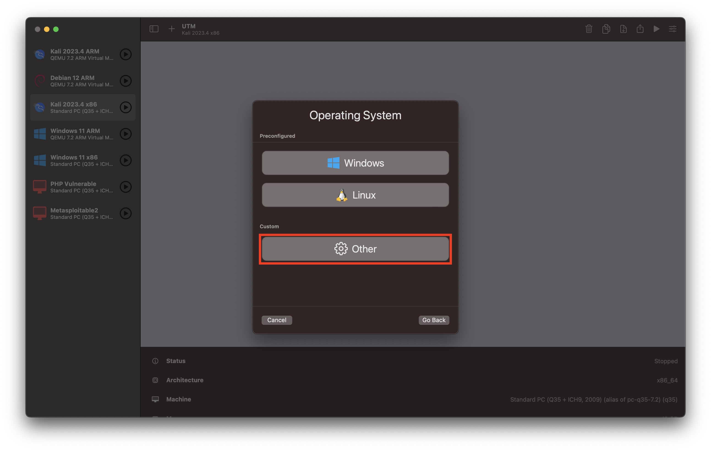

# Conversão de VirtualBox (.ova/.vmdk) para UTM e Parallels Desktop

## 1. Introdução

Este guia tem como objetivo auxiliar na conversão de máquinas virtuais criadas no VirtualBox para o formato compatível com `UTM` e `Paralles Desktop`.

### 1.1. Conceitos Básicos

* **VirtualBox:** é um software de virtualização de código aberto, que permite a criação de máquinas virtuais em diversos sistemas operacionais. É amplamente utilizado em sistemas host de Windows e Linux. Ele utiliza o formato _.ova_/_.vbx_ para suas máquinas virtuais;
* **UTM:** é um software de virtualização para sistemas MacOS, que permite a criação de máquinas virtuais dentro do ecossistema Apple. Seu uso é ideal para Macs com chips da linha M (M1, M2, M3, ...). Ele utiliza o formato _.qemu_ para suas máquinas virtuais;
* **Paralles Desktop:** é um software de virtualização para sistemas MacOS, que permite criação de máquinas virtuais Linux, Windows ou MacOS. Seu uso é ideal para Macs com chips Intel (i3, i5, i7, i9, ...).

## 2. Passos em Comum

Baixe o arquivo fornecido pelo professor.

## 3. Conversão para UTM

Para a conversão será necessária a instalação do qemu, para realizar a conversão da imagem, com o comando `brew install qemu`.

### 3.1. Desempacotando o arquivo .ova

Comece desempacotando o arquivo .ova:

```sh
tar -xvf nome_do_arquivo.ova
```

Localize o arquivo .vmdk gerado. Ele será o arquivo utilizado no próximo passo.

### 3.2. Converter .vmdk para .qcow2

```sh
qemu-img convert -O qcow2 nome_do_arquivo-disk001.vmdk output.qcow2
```

### 3.3. Criando a VM

Utilizando o UTM, clique em `+` para criar uma nova VM.


Agora selecione a opção de **emulação**, caso seu Mac possua um chip da série M (ARM64), pois a imagem fornecida pelo professor está compilada para x86\_64.


Selecione a opção de OS **Other**.



Marque a caixa de **Skip ISO boot** e clique em continuar.


Na secção Hardware é possível configurar os detalhes da sua VM. Neste caso como a máquina será somente invadida, podemos colocar o padrão.


O mesmo pensamento pode ser aplicado para o Armazenamento.


Quanto a pasta compartilhada, é irrelevante.


Marque a opção de **VM settings** e clique em continuar.


Na secção QEMU, desmarque a caixa de **UEFI Boot**.


Em **Drives**, selecione o IDE Drive e clique em **Delete Driver**.


Clique em **New** na secção **Drives**.


Selecione **Import...** e importe a imagem **.vmdk** que você criou nos passos anteriores. E clique em **Save** para finalizar a configuração.


## 4. Conversão para Parallels Desktop

Para a conversão será necessária a instalação do OVFTool da VMware, disponível em: [OVFTool](https://developer.vmware.com/web/tool/ovf/)

### 4.1. Instalação do OVFTool

Para a instalação do OVFTool será necessária a criação de uma conta no site da VMware. Após a criação da conta, será possível baixar o arquivo _.dmg_ do OVFTool.


Ao executar o arquivo _.dmg_ será possível instalar o OVFTool no MacOS.

Por padrão o OVFTool será instalado no diretório `/Applications/VMware OVF Tool/`, havendo necessidade de atualizar seu PATH para que o terminal possa reconhecer o comando `ovftool`.

#### 4.1.1. Atualização do PATH

```bash
nano ~/.zshrc
```

Adicione a seguinte linha ao final do arquivo:

```bash
export PATH="/Applications/VMware OVF Tool:$PATH"
```

Salve e feche o arquivo. Para aplicar as alterações, execute:

```bash
source ~/.zshrc
```

Para atualizar o PATH no terminal, execute:

```bash
echo $PATH
```

Para verificar se o OVFTool foi instalado corretamente, execute:

```bash
ovftool --version
```

O comando acima deverá retornar a versão do OVFTool instalada.

### 4.2. Conversão da Máquina Virtual

Para converter a máquina virtual do VirtualBox para o Parallels Desktop, execute o seguinte comando:

```bash
ovftool --lax DIRETORIO_DA_MAQUINA_VIRTUAL.ova DIRETORIO_DA_MAQUINA_VIRTUAL.vmx
```

`É importante que este comando seja executado em um diretório vazio e que suporte arquivos de grande tamanho.`
