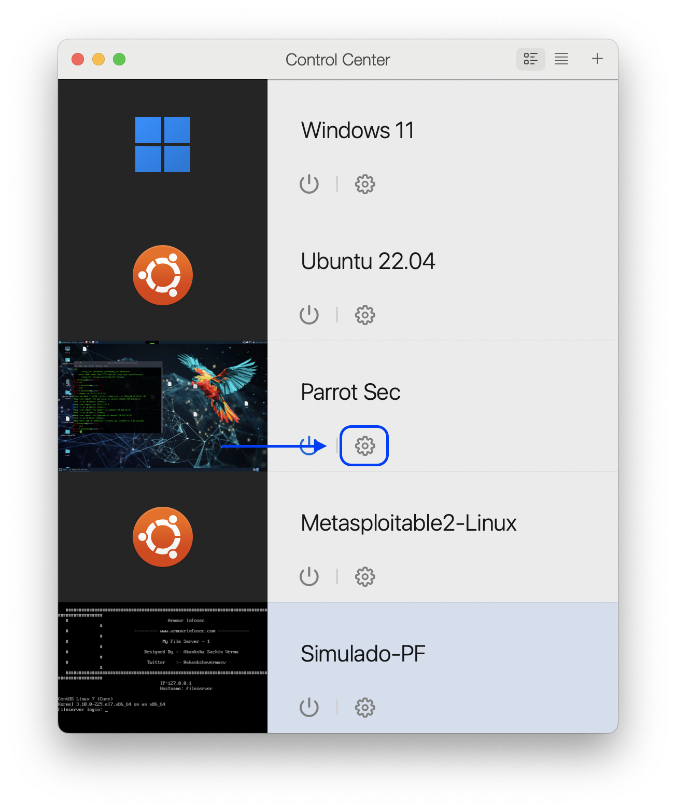
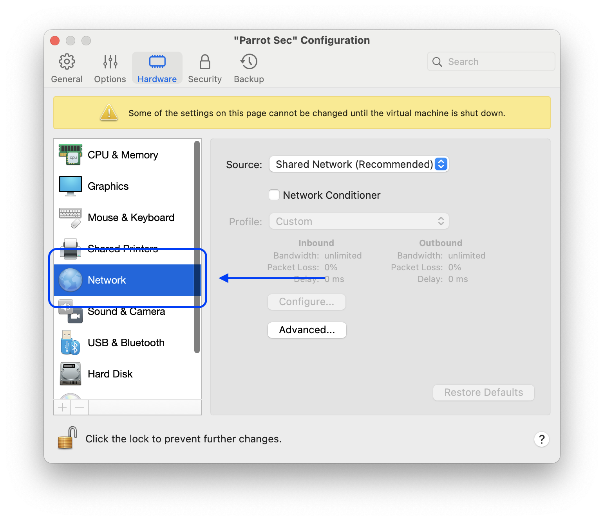
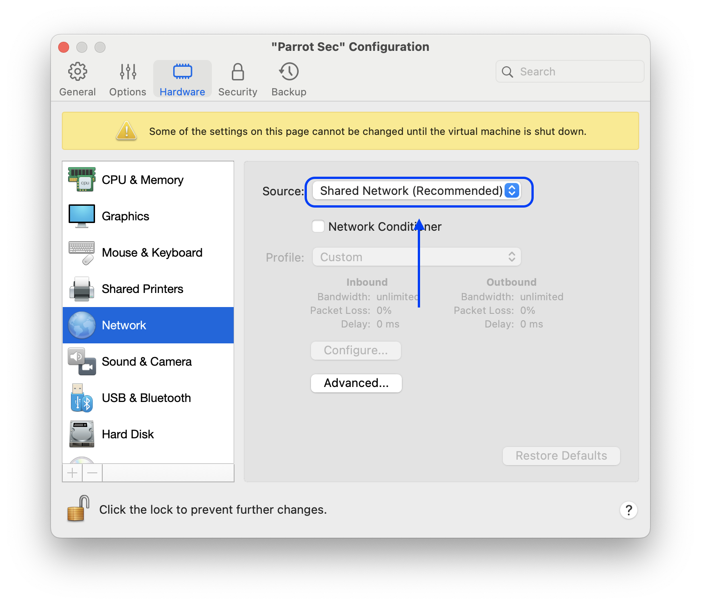
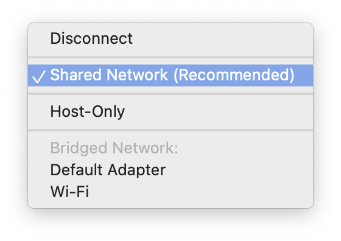
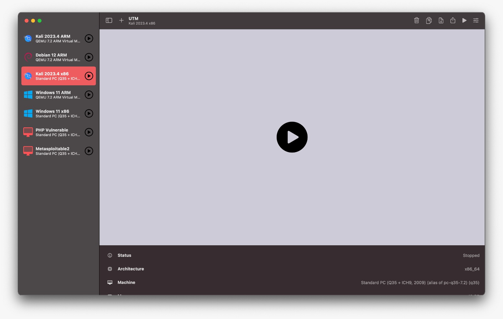
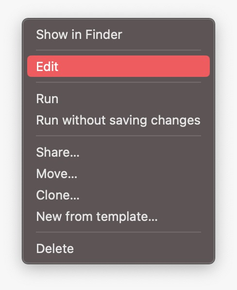
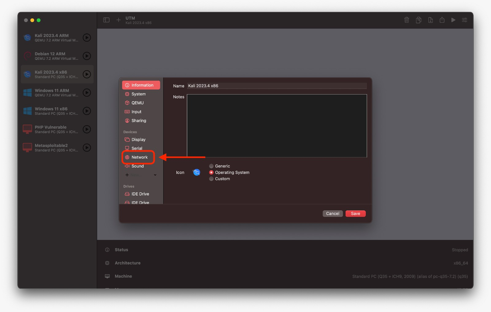
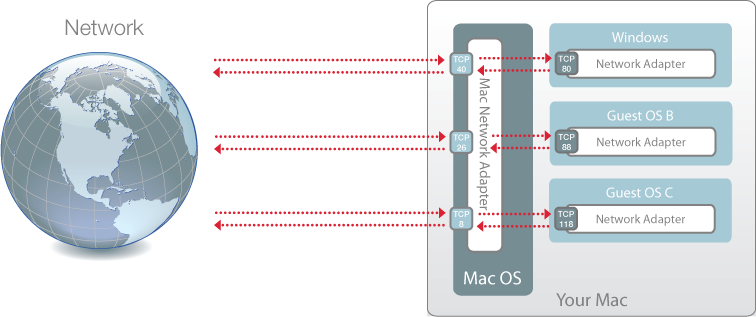

# Guia para Acessar Máquinas Virtuais do Parallels Desktop e UTM

## 1. Introdução

Na matéria de Tecnologias Hacker, haverá a necessidade, em múltiplos momentos, de se utilizar uma máquina Linux atacante (Parrot Security OS ou Kali Linux) em conjunto com outra máquina que será a vítima (Metasploitable). Para realizar este acesso normalmente é utilizada rede celular externa, uma vez que há a necessidade do roteador disponibilizar dois IPs diferentes para as máquinas virtuais - funcionalidade bloqueada na rede da universidade.

Para contornar este problema é possível utilizar no Paralles Desktop e UTM a funcionalidade de rede privada, que permite a comunicação entre as máquinas virtuais - e, caso necessário, entre o computador hospedeiro.

Caso você tenha computadores `Windows` este guia **NÃO** terá utilidade para você, pois o Parallels Desktop e o UTM são exclusivos para `macOS`.

**Para análise de vunerabilidades, e uso de ferramentas especificas é possível que a rede da universidade bloqueie seu acesso, havendo a necessidade de se utilizar rede celular.**

## 2. Parallels Desktop

Para alterar a configuração de rede do Parallels Desktop, siga os passos abaixo:

## 3. UTM

Clique com o botão direito na máquina virtual que deseja configurar a rede e clique em `Edit`.

## 4. Entendendo a Rede Privada

Esta é a topologia de rede que o Parallels Desktop e o UTM utilizam para a rede privada:

[Paralles Website](https://download.parallels.com/desktop/v12/docs/pt_BR/Parallels%20Desktop%20User%27s%20Guide/33341.htm)